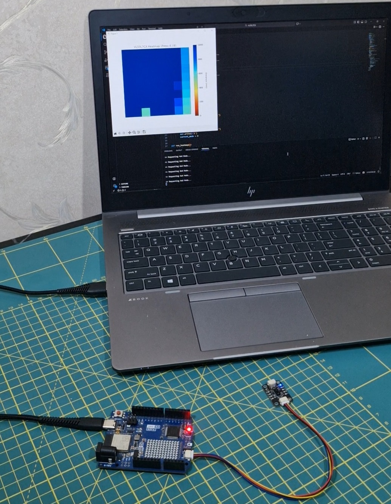

Here is a concise and professional `README.md` file based on the code provided.

# VL53L7CX Real-Time Lidar Heatmap

This project visualizes distance data from the STMicroelectronics **VL53L7CX Time-of-Flight (ToF) sensor** as a real-time heatmap. It combines an Arduino sketch for hardware control and a Python script for live rendering, allowing dynamic switching between resolution modes.

## Features
- **Dynamic Resolution Switching:** Toggle between **4x4 (60Hz)** high-speed mode and **8x8 (15Hz)** high-resolution mode on the fly.
- **Bi-Directional Control:** Switch sensor modes directly from the Python visualization window.
- **Real-Time Visualization:** Fluid heatmap rendering using Matplotlib with auto-scaling color depth.
- **Smart Filtering:** Automatically filters invalid targets.

## Hardware Requirements
- **Sensor:** [VL53L7CX Breakout board](https://embeddedtech.ir/shop/vl53l7cx-module/).
- **Microcontroller:** Arduino-compatible board (we use [Arduino UNO R4 Wifi](https://embeddedtech.ir/product/arduino-uno-r4-wifi/)).
- **Connections:**
  - I2C SDA/SCL (Connected to `Wire1` pins on your board or connect via qwiic connector).
  - RST Pin (Defined as `A1` in code).
  - Power (3.3V/5V and GND).



## Software Dependencies

### Arduino IDE
You must install the specific driver library for the sensor:
1. Open Arduino IDE.
2. Go to **Sketch** > **Include Library** > **Manage Libraries**.
3. Search for and install **"VL53L7CX"** by STMicroelectronics.

### Python
Install the required Python packages via pip:
```bash
pip install pyserial numpy matplotlib
```
## Setup & Usage

### 1. Flash the Microcontroller
1. Open `lidar_heatmap.ino` in the Arduino IDE.
2. Check the `// --- Pin Definitions ---` section.
   - The code uses `Wire1`. If your board uses the standard I2C bus, change `&Wire1` to `&Wire`.
   - (Optional) Verify `I2C_RST_PIN` matches your wiring.
3. Upload the code to your microcontroller.
4. (Optional) Open the Serial Monitor (Baud: `921600`) to verify the sensor is found, then **close it** (Python cannot connect if Serial Monitor is open).

### 2. Run the Visualization
1. Open `lidar_heatmap.py` in a text editor.
2. Update the `COM_PORT` variable to match your device:
   ```python
   COM_PORT = 'COM4' # Windows example (check Device Manager)
   # COM_PORT = '/dev/ttyUSB0' # Linux/Mac example
   ```
3. Run the script:
   ```bash
   python lidar_heatmap.py
   ```

## Controls
Focus the Python Heatmap window and use your keyboard to control the sensor:

| Key | Mode | Description |
| :--- | :--- | :--- |
| **4** | **4x4 Mode** | Switches sensor to 4x4 zones at **60Hz** (Faster, lower res). |
| **8** | **8x8 Mode** | Switches sensor to 8x8 zones at **15Hz** (Slower, higher res). |

## Troubleshooting
- **Connection Error:** Ensure the Serial Monitor is closed before running the Python script.
- **Sensor Not Found:** Check your wiring, specifically the `I2C_RST_PIN`.
- **No Data/Black Screen:** Ensure the Baud Rate in Python matches the Arduino sketch (`921600`).
